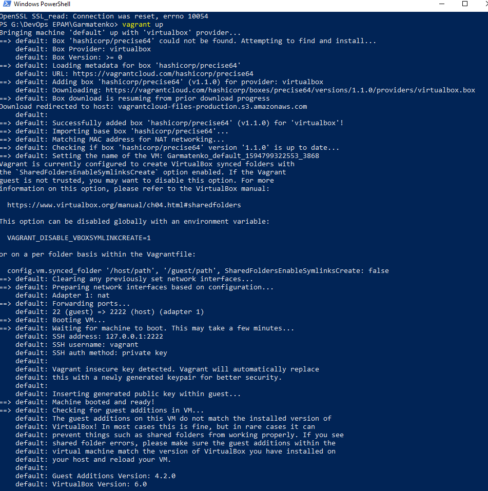
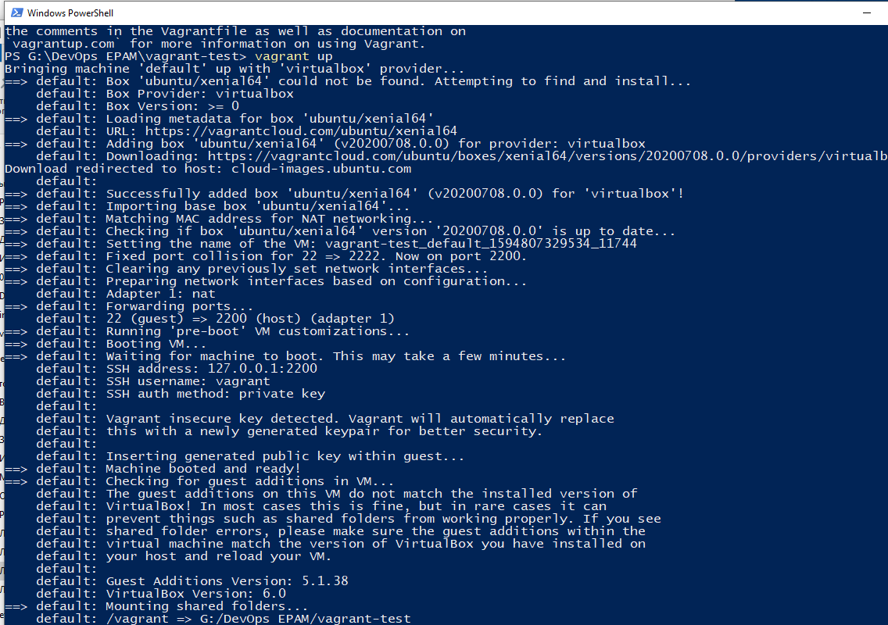

## Part 1
VirtualBox was installed and VM1_Garmatenko virtual machine was created. Ubuntu Server OS is installed inside.

 

Cloned VM1 and created VM2_Garmatenko, which were combined into a group. Functions tested
start, stop, reboot, save state. 

VM1 exported to file VM1_Garmatenko_exp.ova. From it, the VM1_Garmatenko_import machine was later created.

Forwarding of USB ports from the host to the virtual is configured. 

Also verified the operation of VBoxManage through the CLI.

Checked different network settings.

| mode | VM -> host | VM <- host | VM1 -> VM2 | VM ->Net/LAN | VM <- Net/LAN |
|----------|----------|---|---|---|---|
| host only | + | + | + | - | - |
| internal  |  - | - | + | - | - |
| bridge | +| + | + | + | + |
| nat  | +|  | - | + |  |
| nat service  |+|  | + | + |  |

## Part 2

Vagrant is downloaded and installed, a working folder is created. Created working environment for hashicorp / precise64. The results of the vagrant up command:

Connect to VM via PuTTY and current date and time

As a prime, we will create a virtual machine with an Ubuntu server and install Nginx on it.

As a result, we get a working web server.

