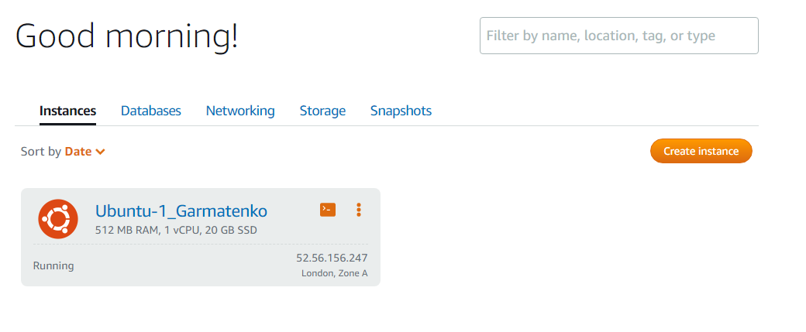
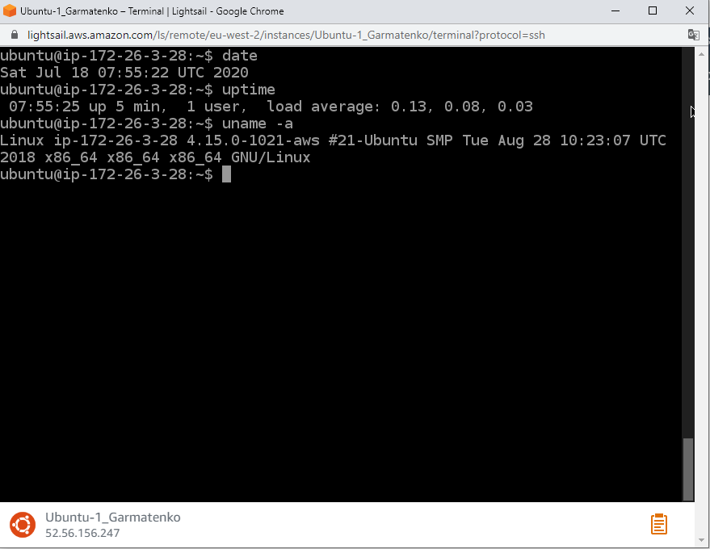
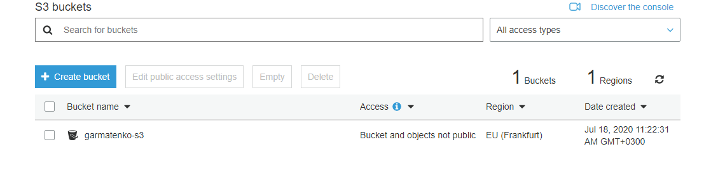
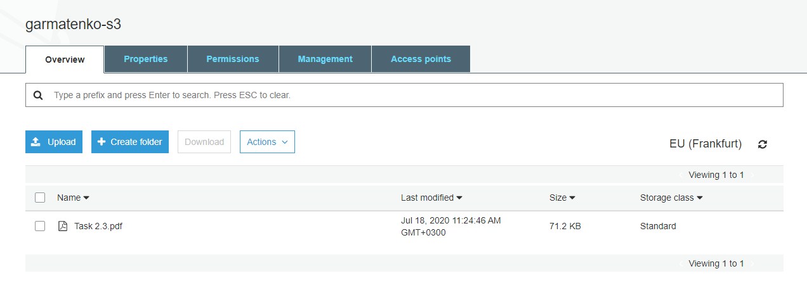
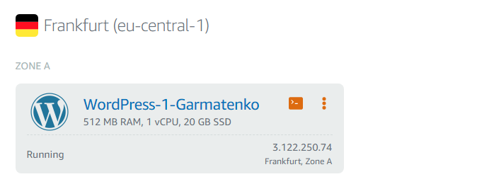
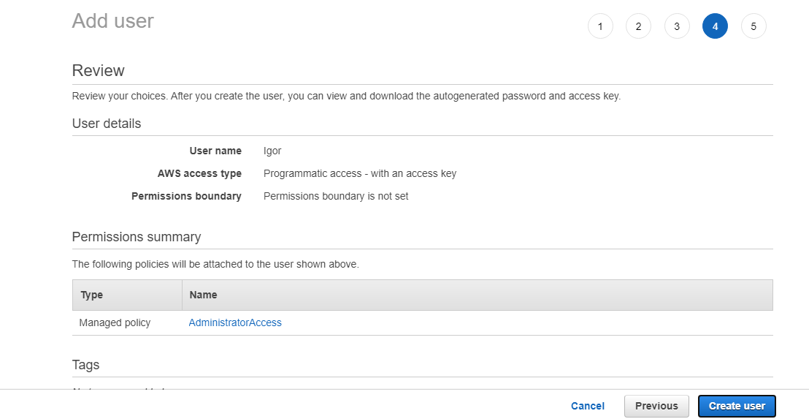
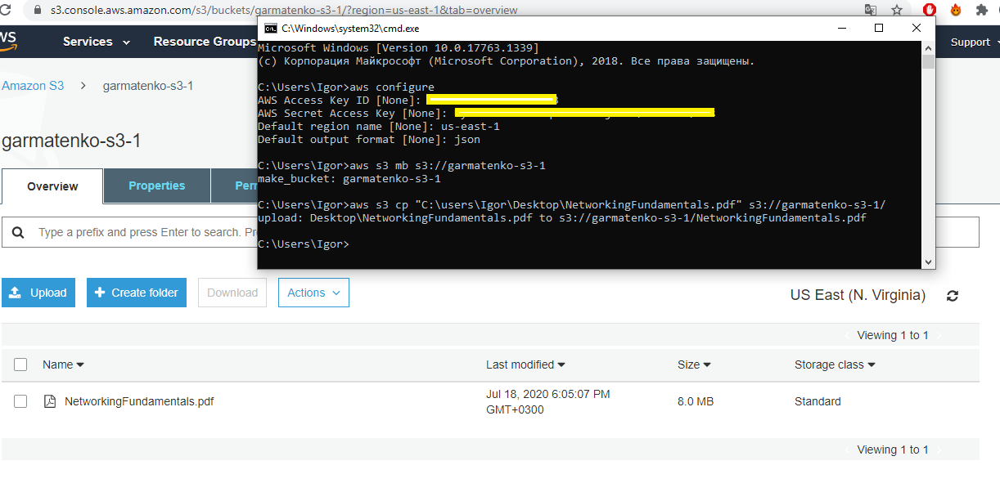


# Task 2.3
## 1
At this point I got acquainted with the AWS Free Tier. Which services can be tried for free and what are the limitations.

## 2
I got acquainted with the work of the AWS Lightsail service. An Amazon Linux instance was created in Lightsail. Connected via SSH. Screenshots are attached.

## 3
I got acquainted with Amazon S3. Created Amazon S3 bucket, tested upload, download, delete files, deleted bucket.

## 4
In this step, I managed to work with the CMS Wordpress on AWS.

## 6
An AWS IAM user account has been created. I installed the AWS CLI on my work computer. Completed AWS CLI configuration and tested basic functionality. Screenshots below.

## 7

<a href="http://garmatenko-s3-1.s3-website-us-east-1.amazonaws.com/" target="_blank">My static site in S3</a>