
# Task3.1

## 1.
We will install the database on Centos 7. First of all, we must update our system.
```bash
sudo yum update
```
After that, we need to download the MySQL repositories.

```bash
sudo wget https://dev.mysql.com/get/mysql80-community-release-el7-3.noarch.rpm
```

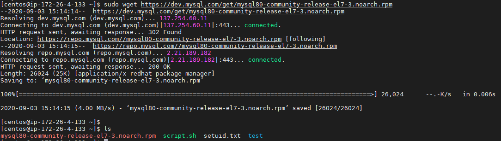

Now we need to prepare the repository so that we can later install the MySQL packages from it.

```bash
sudo rpm -Uvh mysql80-community-release-el7-3.noarch.rpm
```

Now we can install MySQL.

## 2.

To install, enter the command:

```bash
sudo yum install mysql-server
```

MySQL needs to be started manually using the command:
```bash
sudo systemctl start mysqld
```

To check if it works correctly, use the command:
```bash
sudo systemctl status mysqld
```
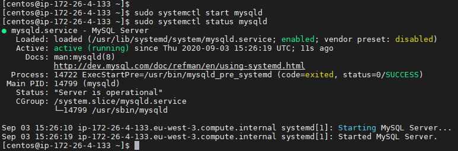

## 3.
Let's create an airline database as a test one. It will contain 3 tables - flights, airports and aircrafts.

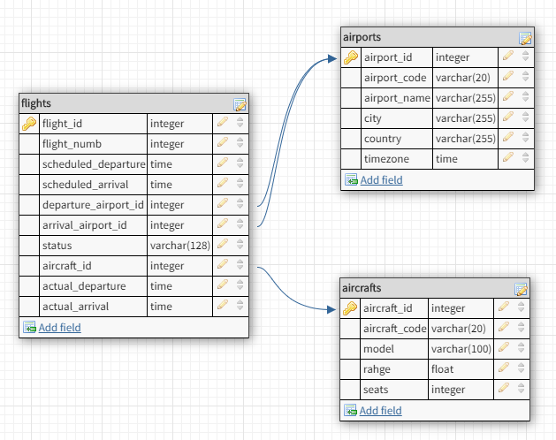

## 4.

Let's create a database **Airline** and switch to it.

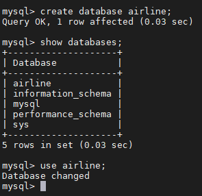

## 5.

Let's create tables and fill them with data.

```sql
CREATE TABLE airports (
    airport_id smallint unsigned NOT NULL AUTO_INCREMENT,
    airport_code varchar(20) UNIQUE,
    airport_name varchar(255),
    city varchar(255),
    country varchar(255),
    timezone time,
    PRIMARY KEY (airport_id)
);

CREATE TABLE aircrafts (
    aircraft_id smallint unsigned NOT NULL AUTO_INCREMENT,
    aircraft_code varchar(20) UNIQUE,
    model varchar(255),
    max_range int(10),
    seats smallint unsigned,
    PRIMARY KEY (aircraft_id)
);

CREATE TABLE flights (
    flight_id smallint unsigned NOT NULL AUTO_INCREMENT,
    fligfht_numb varchar(20),
    scheduled_departure timestamp,
    scheduled_arrival timestamp,
    departure_airport_id smallint unsigned,
    arrival_airport_id smallint unsigned,
    status varchar(128),
    aircraft_id smallint unsigned,
    actual_departure timestamp,
    actual_arrival timestamp,
    PRIMARY KEY (flight_id),
    FOREIGN KEY (departure_airport_id) REFERENCES airports(airport_id),
    FOREIGN KEY (arrival_airport_id) REFERENCES airports(airport_id),
    FOREIGN KEY (aircraft_id) REFERENCES aircrafts(aircraft_id)
);
```
We have 3 tables.

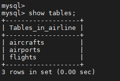

Let's execute SQL queries that will enter data into tables.

```sql
insert into aircrafts values (default,'B772','Boeing 777-200',11165,505), (default,'B77W','Boeing 777-300ER',17500,550), (default,'320','Airbus A320',5700,150);

insert into airports values (default,'KPB', 'Boryspil',	'Kyiv',	'Ukraine', '03:00:00'), (default,'IEV', 'Sikorsky Airport','Kyiv',	'Ukraine', '03:00:00'), (default,'LHR', 'London Heathrow Airport',	'London',	'United Kingdom', '00:00:00'), (default,'ROV', 'Platov',	'Rostov on Don','Russia', '03:00:00'), (default,'FCO', 'Aeroporti di Roma','Rome','Italy', '02:00:00');

insert into flights values (default,'FR-3678','2020-09-05 12:50:00','2020-09-05 14:20:00',1,3,'Boarding',1,'2020-09-05 13:10:00','2020-09-05 14:40:00'), (default,'FR-2818','2020-09-04 15:50:00','2020-09-04 19:20:00',5,3,'Check-in',3,'2020-09-04 15:50:00','2020-09-04 19:20:00'), (default,'RG-5483','2020-09-02 11:50:00','2020-09-02 13:50:00',2,4,'Take-Of',2,'2020-09-02 11:55:00','2020-09-02 14:10:00');
```

Queries to view the contents of each table.

```sql
SELECT * FROM AIRCRAFTS;
SELECT * FROM AIRPORTS;
SELECT * FROM FLIGHTS;
```
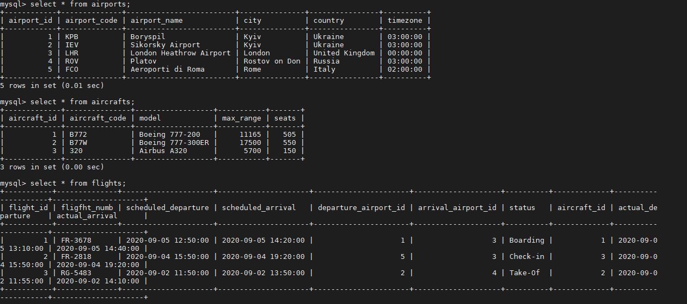

## 6.

 Сommand create is an example of **DDL** commands, also these commands include DELETE, ALTER, TRUNCATE. Let's execute queries with these commands.

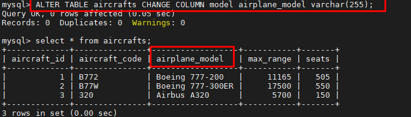

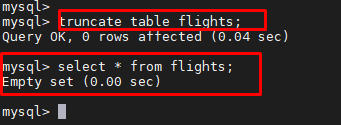

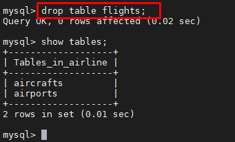

Examples of **DML** commands are SELECT, INSERT, which we have already used above, as well as UPDATE, DELETE and others. We use some of them.

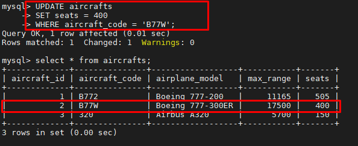

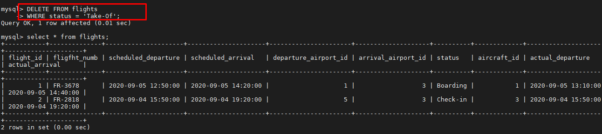

Data Control Language (**DCL**) - these are operators for managing permissions, with the help of them we can allow or deny the execution of certain operations on database objects. Let's give examples in point 7.

## 7.

Let's create several users with different rights. User_ro will have read-only rights from all tables, user2 will have write access only to the aircrafts table.

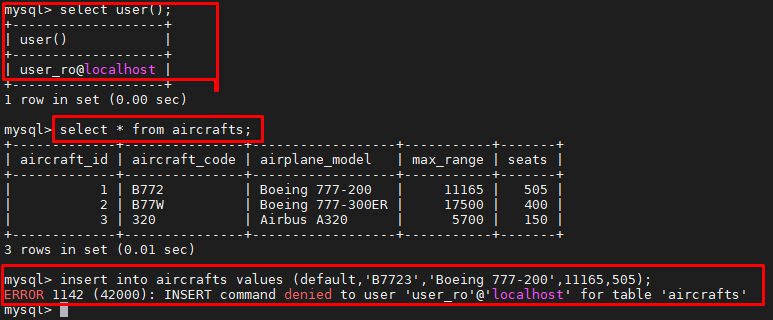

We see that the user can read, but cannot write data to tables.

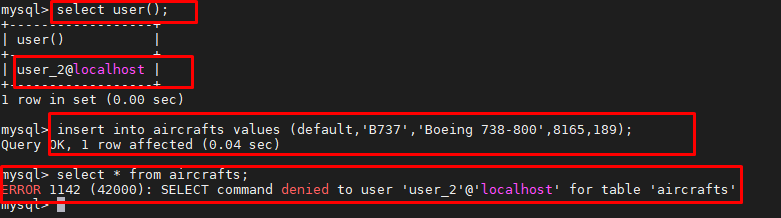

We see that the user can write data to the table **aircrafts**, but he has no rights to read.

Let's remove user2 write permissions to the table **aircrafts**.

```sql
REVOKE ALL PRIVILEGES ON airline.aircrafts FROM 'user_2'@'localhost';
```

After that, when trying to access the database, we see an error, since user_2 could only write data to one table aircrafts, and after removing these rights, he does not have any access to the database airline at all.

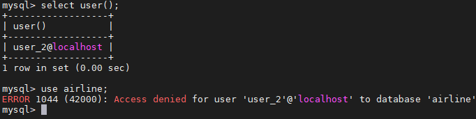