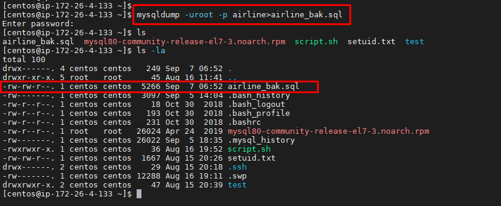
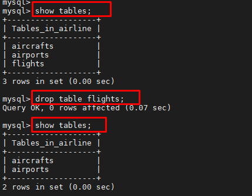
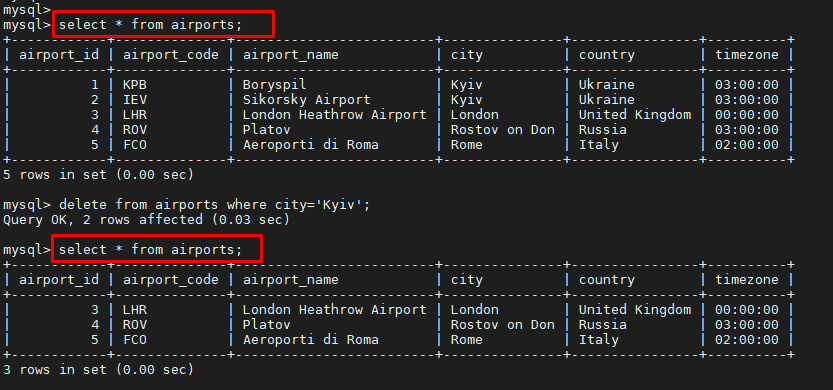
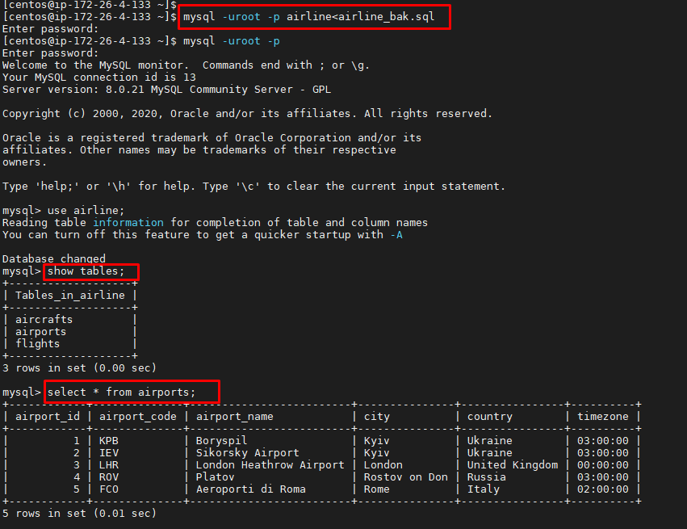
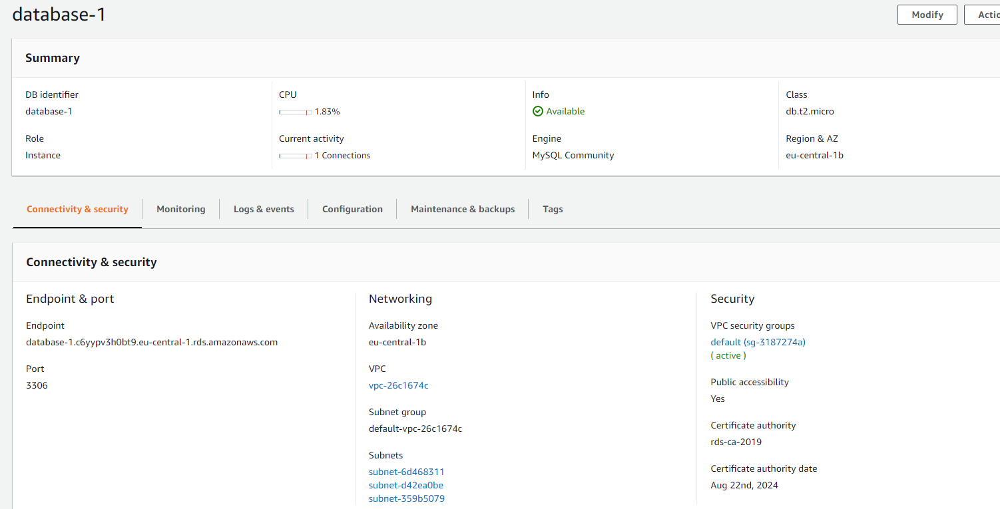
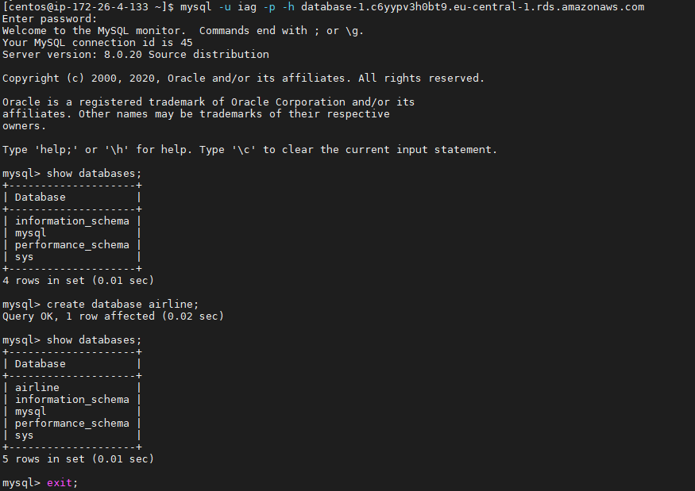
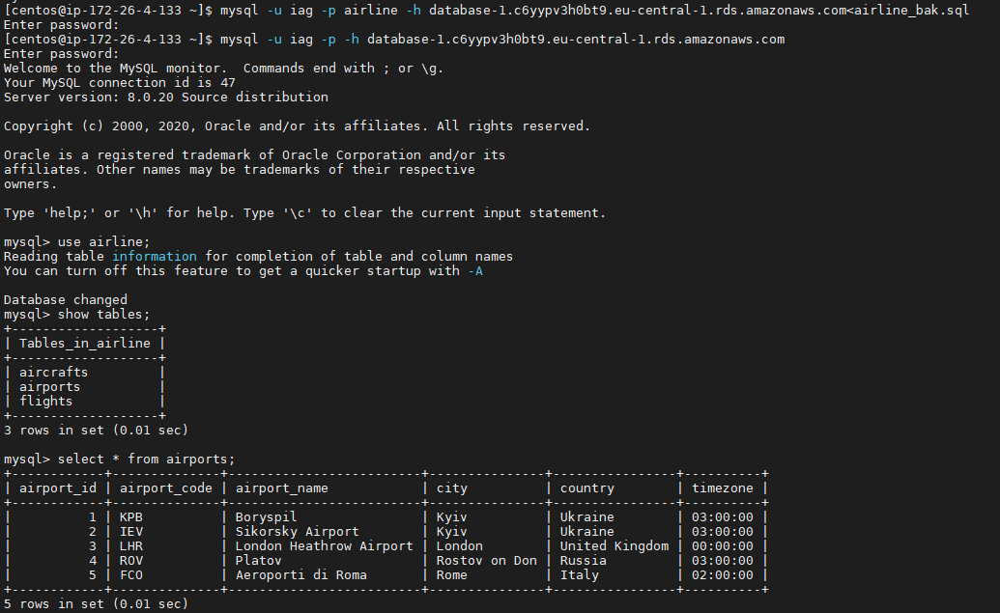

# Task3.2

To back up a single database, we can use the standard program **mysqldump**.

```sql
mysqldump -uroot -p airline>airline_bak.sql
```


Now let's delete the **flights** table.



We will also delete some records from the **airports** table.



We can restore the base by directing the flow in the opposite direction by running the command:

```sql
mysql -uroot -p airline<airline_bak.sql
```



As we can see, the **flights** table was restored and the records were deleted from the **airports** table.

Let's create create a database in RDS.



After we have created a database in RDS, we will connect to it from our local machine and create an **airline** database.



And now we will restore the database from the backup **airline_bak.sql** using the command:

```sql
mysql -u iag -p airline -h database-1.c6yypv3h0bt9.eu-central-1.rds.amazonaws.com<airline_bak.sql
```


 
