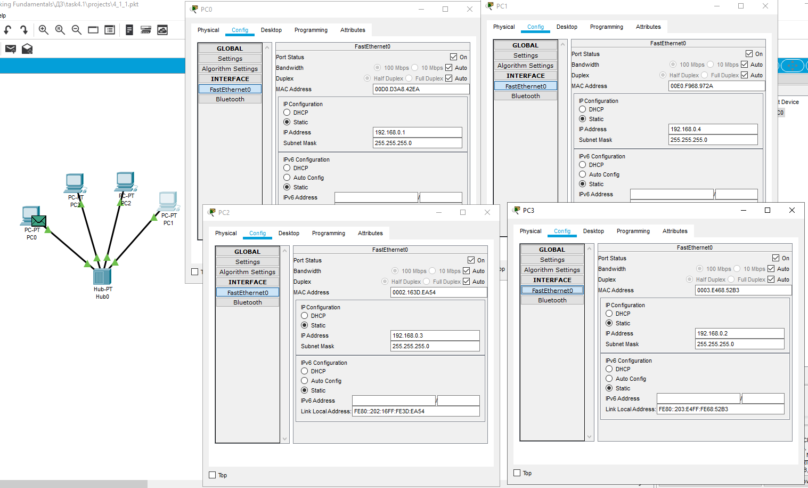
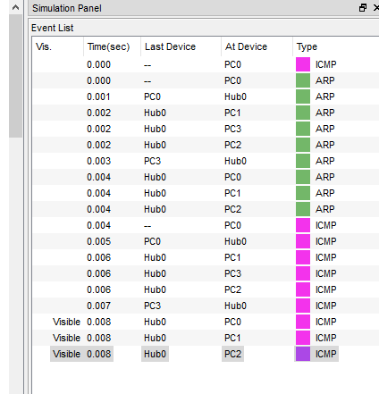
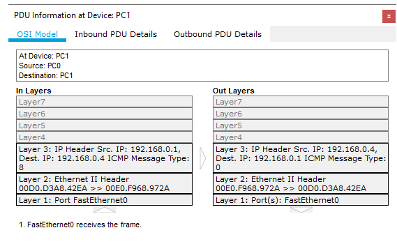
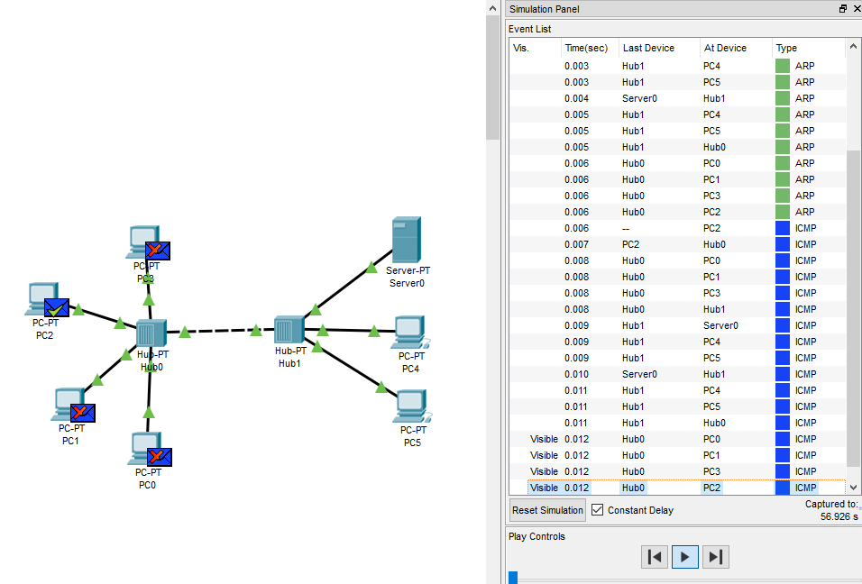
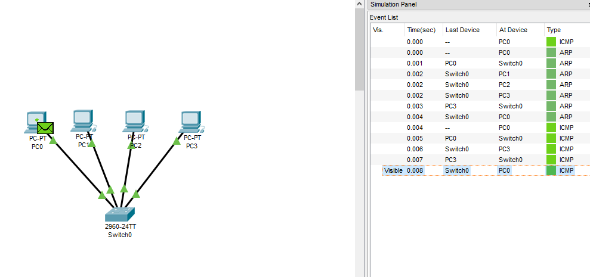
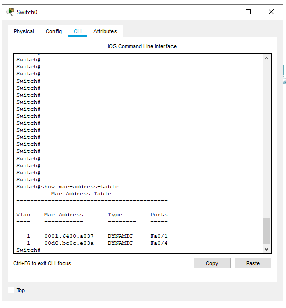
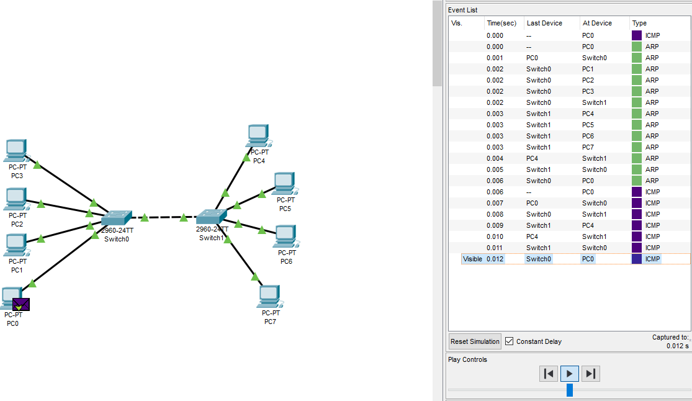
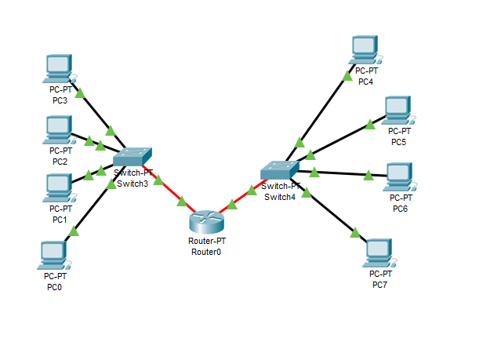

# Task 4.1

## 1.

При выполнении ICMP запроса с PC0 на PC3 мы наблюдаем следующую картину: Сначала PC0 формирует ARP запрос, чтобы узнать MAC адрес нужного компьютера PC3 по его IP, а после этого  формирует ICMP пакет и отправляет его на хаб, который принимает этот пакет и пересылает на все порты, кроме того, с которого он был получен. PC2 и PC1 принимают пакет, видят что IP адрес назначения не совпадает с их собственными IP  и отбрасывают принятый пакет. PC3 принимает пакет, видит что он предназначен ему и высылает ICMP ответ.

Если удалить IP адреса с PC0 - PC3, то данные между устройствами передаваться не будут.

## 2.

В схеме с двумя хабами все происходит так же, только хабы нужно соединять между собой кроссом.

## 3.

В сети к коммутатором все происходит схожим образом как с хабом, только кадры пересылаются не на все порты, а только на определенные, так как в процессе работы на коммутаторе формируется таблица коммутации с соответствием порта и мак адреса устройства за этим портом.

## 4.

Топология с 8 компьютерами и 2 коммутаторами

## 5.

Сеть с маршрутизатором.  Использование роутера дает возможность пересылать данные между отдельными подсетями и разбить сеть на отдельные широковещательные домены. 
Хост смотрит на ip адрес источника, ip назначения, маску подсети и если  определяет, что адрес назначения находится в другой подсети, то данные пересылаются на шлюз по умолчанию.
