# Task4.2

## Задание 1.

Соберем схему сети для двух зданий.

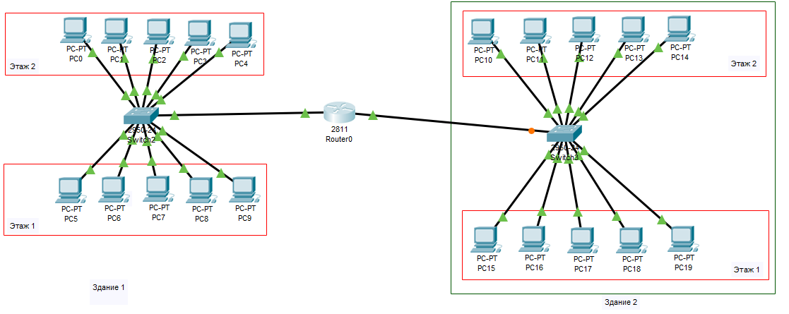

На каждое здание поставим по одному коммутатору, к которому по витой паре будут подключены ПК с обоих этажей. Коммутаторы подключены к маршрутизатору, который разместим в серверной одного из этих зданий. 
Настроим интерфейсы маршрутизатора.


Также на маршрутизаторе поднимем DHCP сервер, который будет выдавать сетевые настройки для каждой сети.


Посмотрим список выданных адресов


Видим что компьтеры успешно получили настройки - IP адрес и шлюз по умолчанию.

Проверим работоспособность сети отправкой ICMP пакетов между компьютерами разных зданий.

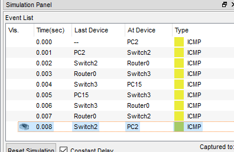

ICMP запрос успешно выполнен.

## Задание 2.

Для решения задачи собираем следующую схему:

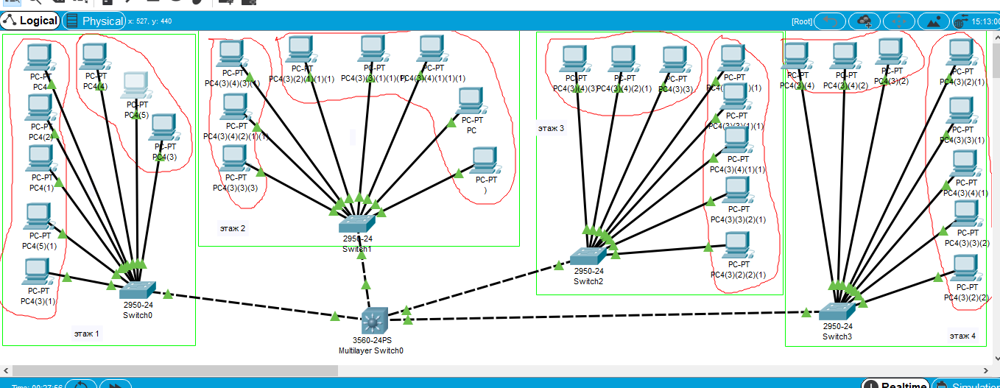

На кажом этаже есть группы из 5 и 3 ПК соответсвенно, которые подключены к коммутатору доступа. Они в своию очередь объединяются общим коммутатором L3.

Создадим 8 VLANов, каждый будет соответствовать своей подсети. Пусть эти будут подсети:
```dos
172.16.10.0/24
172.16.11.0/24
172.16.12.0/24
172.16.13.0/24
172.16.14.0/24
172.16.15.0/24
172.16.16.0/24
172.16.17.0/24
```
Создадим на коммутаторах доступа соответствующие VLANы 

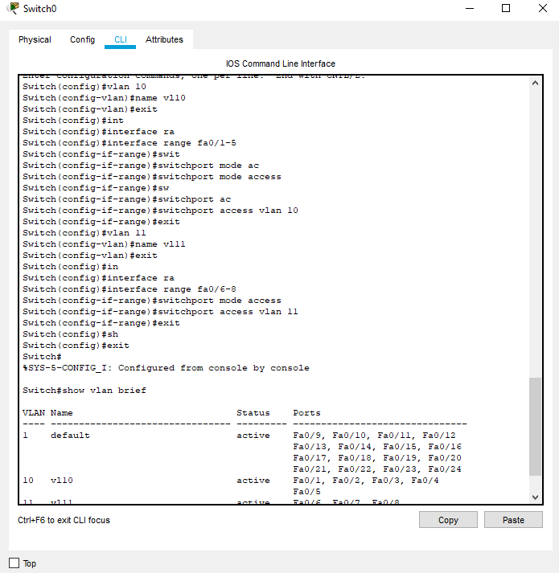

и транковый порт для соединения с коммутатором L3.

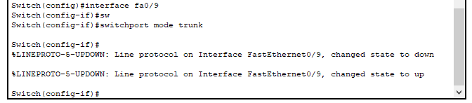

Аналогичные действия выполним для оставшихся коммутаторов доступа, создавая VLAN 12-17.

Создадим VLANы на коммутаторе L3 и назначим VLAN интерфейсам IP адреса.


Далее создадим для каждого VLAnа свой DHCP сервер. Включаем маршрутизацию на коммутаторе и создаем пулы DHCP.


Видим список IP, которые были разданы компьютерам. Кажды получил адрес соответствующий своему влану.


Выполним проверку связи между ПК 172.16.10.1 и 172.16.12.1, как видим со скриншота, ICMP пакеты проходят.

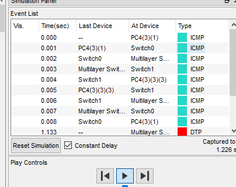

Таблица маршрутизации вланов на коммутаторе:

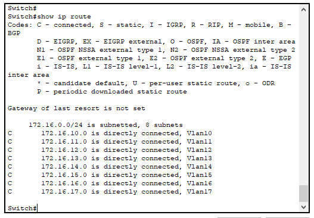


## Задание 3.

Схема сети будет подобна предыдущему заданию - на каждое здание отдельный коммутатор и влан, все коммутаторы соединены с вышестоящим L3 коммутатором Cisco 3560 в нашем случае, который подключен к маршрутизатору.

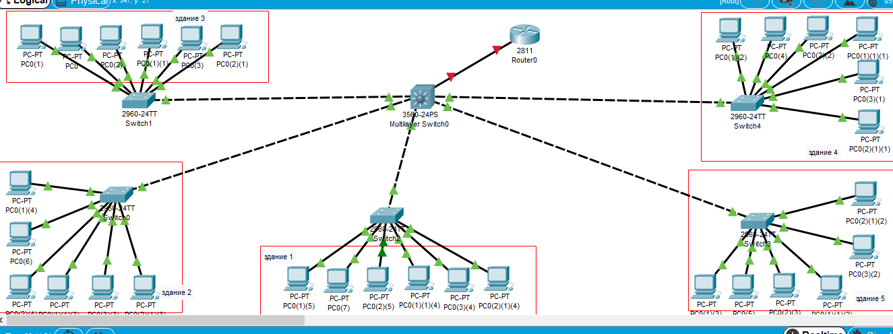

На коммутаторах доступа добавим все порты в соответствующий влан, и один порт сделаем транковым для связи с вышестоящим коммутатором.

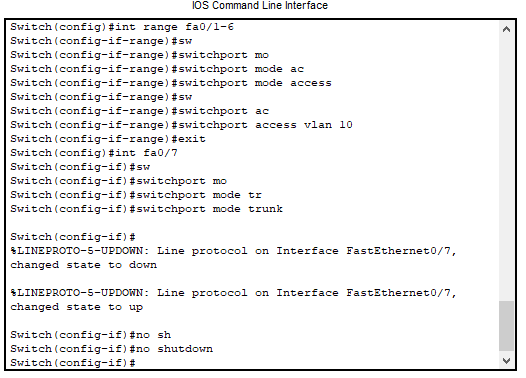

Повторим эти действия для каждого влана - 10,20,30,40,50.
На L3 создаем эти вланы, каждому влану присваиваем IP адрес, включаем ip routing создаем пулы адресов dhcp для отдельных подсетей.


```dos
Switch(config)#int vlan 10
Switch(config-if)#ip address 172.16.10.254 255.255.255.0
Switch(config-if)#exit
Switch(config)#int vlan 20
Switch(config-if)#ip address 172.16.20.254 255.255.255.0
Switch(config-if)#exit
Switch(config)#int vlan 30
Switch(config-if)#ip address 172.16.30.254 255.255.255.0
Switch(config-if)#exit
Switch(config)#int vlan 40
Switch(config-if)#ip address 172.16.40.254 255.255.255.0
Switch(config-if)#int vlan 50
Switch(config-if)#ip address 172.16.50.254 255.255.255.0
Switch(config-if)#exit
Switch(config)#ip routing
Switch(config)#ip dhcp pool vl10
Switch(dhcp-config)#network 172.16.10.0 255.255.255.0
Switch(dhcp-config)#default-router 172.16.10.254
Switch(dhcp-config)#exit
Switch(config)#ip dhcp pool vl20
Switch(dhcp-config)#network 172.16.20.0 255.255.255.0
Switch(dhcp-config)#default-router 172.16.20.254
Switch(dhcp-config)#exit
Switch(config)#ip dhcp pool vl30
Switch(dhcp-config)#network 172.16.30.0 255.255.255.0
Switch(dhcp-config)#default-router 172.16.30.254
Switch(dhcp-config)#exit
Switch(config)#ip dhcp pool vl40
Switch(dhcp-config)#network 172.16.40.0 255.255.255.0
Switch(dhcp-config)#default-router 172.16.40.254
Switch(dhcp-config)#exit
Switch(config)#ip dhcp pool vl50
Switch(dhcp-config)#network 172.16.50.0 255.255.255.0
Switch(dhcp-config)#default-router 172.16.50.254
Switch(dhcp-config)#exit
Switch(config)#
```

Првоерим связь между ПК в разных подсетях. Пакеты проходят.

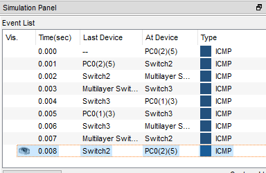

Теперь настроим связь с маршрутизатором Router0. Трафик, не предназначенный сетям существующих VLAN должен передаваться на Router0.

Настройка коммутатора:

```dos
Switch(config)#interface fa0/6
Switch(config-if)#ip address 192.168.1.1 255.255.255.0
Switch(config-if)#no shutdown 
Switch(config-if)#no switchport 
Switch(config-if)#exit
Switch(config)#ip route 0.0.0.0 0.0.0.0 192.168.1.254
Switch(config)#
```
Настройка маршрутизатора:

```dos
Router(config)#int fa0/0
Router(config-if)#ip address 192.168.1.254 255.255.255.0
Router(config-if)#no shutdown
Router(config)#ip route 172.16.20.0 255.255.255.0 192.168.1.1
Router(config)#ip route 172.16.10.0 255.255.255.0 192.168.1.1
Router(config)#ip route 172.16.30.0 255.255.255.0 192.168.1.1
Router(config)#ip route 172.16.40.0 255.255.255.0 192.168.1.1
Router(config)#ip route 172.16.50.0 255.255.255.0 192.168.1.1
```

Пинги с ПК проходят на маршрутизатор и обратно.

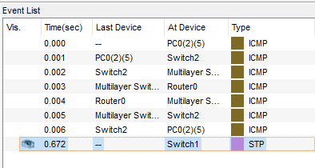


