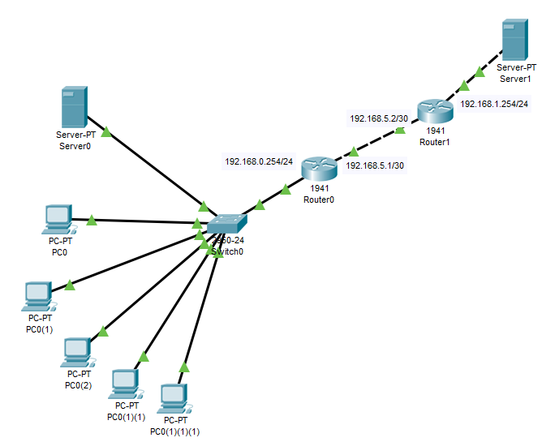

# Task4.3

Соберем схему с двумя маршрутизаторами с учетом поправок из задания 4.4.1.



Компьютеры имеют адреса <mark>192.168.0.1 - 192.168.0.5</mark>, сервер 0 адрес <mark>192.168.0.10</mark>, интерфейс на маршрутизаторе Router0, который смотрит в локальную сеть <mark>192.168.0.254</mark>, он будет шлюзом по умолчанию для этой сети. 

Сервер 1 имеет адрес <mark>192.168.1.20</mark>, Router1 <mark>192.168.1.254</mark>.

Для связи между роутерами выберем подсеть <mark>192.168.5.0/30</mark>, где <mark>192.168.5.1/30</mark> и <mark>192.168.5.2/30</mark> - адреса интерфейсов маршрутизаторов, <mark>192.168.5.3/30</mark> - широковещательный.

Выполним настрйоки на маршрутизаторе Router0:

```dos
Router(config)#int gigabitEthernet 0/0
Router(config-if)#ip address 192.168.5.1 255.255.255.252
Router(config-if)#no shutdown 
Router(config-if)#exit
Router(config)#int gigabitEthernet 0/1
Router(config-if)#ip address 192.168.0.254 255.255.255.0
Router(config-if)#no shutdown 
Router(config-if)#exit
Router(config)#
Router(config)#router rip
Router(config-router)#version 2
Router(config-router)#network 192.168.0.0
Router(config-router)#network 192.168.5.0
```

и на Router1:

```dos
Router(config)#int gigabitEthernet 0/1
Router(config-if)#ip address 192.168.5.2 255.255.255.252
Router(config-if)#no shutdown 
Router(config-if)#exit
Router(config)#int gigabitEthernet 0/0
Router(config-if)#ip address 192.168.1.254 255.255.255.0
Router(config-if)#no shutdown 
Router(config-if)#exit
Router(config)#router rip
Router(config-router)#version 2
Router(config-router)#network 192.168.5.0
Router(config-router)#network 192.168.1.0
Router(config-router)#exit
```


Выполним тестирование, посылая ICMP запросы между разными сетями.


Как видим, пакеты успешно проходят в обоих направлениях.