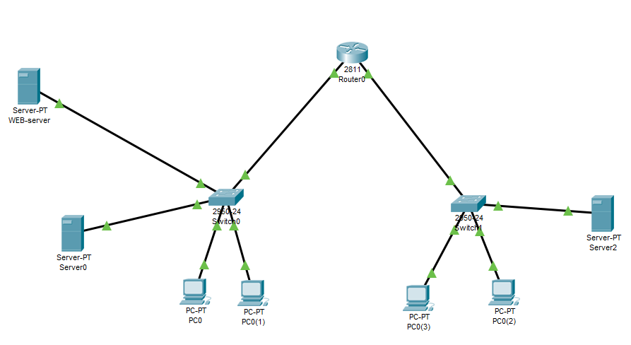
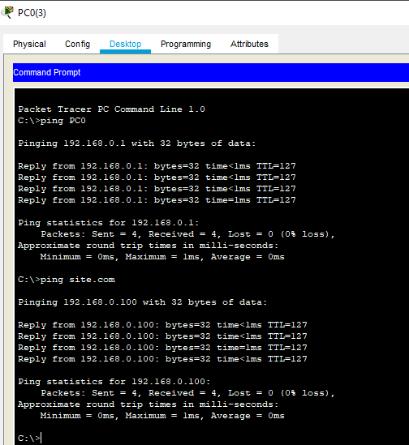
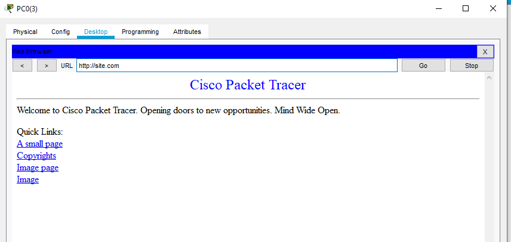

# Task4.4

## Задание 1. 
Было выполнено в рамках задания 4.3.

## Задание 2. 

Соберем следующую схему:

Компьютеры PC0, PC0(1), Server0 и Web-server находятся в подсети 192.168.0.1/24, PC0(3), PC0(2), Server2 в сети 192.168.1.0/24.
Server2 настроим в качестве DNS сервера, куда внесем записи, которые соответствуют хостам из нашей сети.

Выполним тестирование, пропинговав устройства из разных подсетей по имени.

Также откроем страницу site.com, которая соответствует веб-серверу, через браузер.

