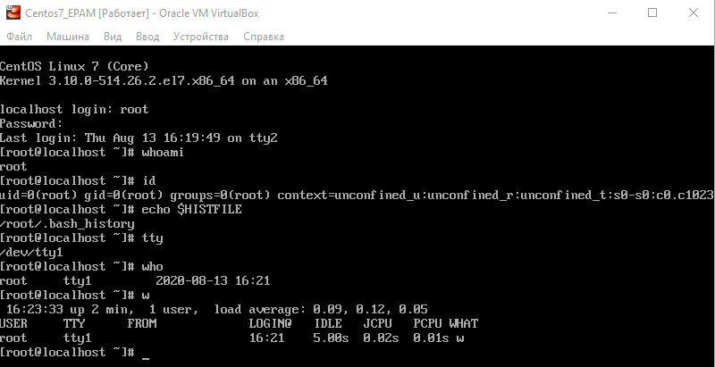
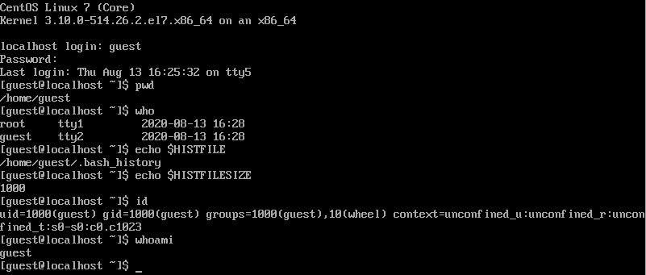
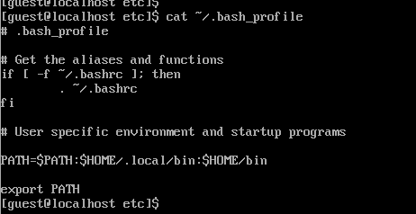

# Task5.1
## 1

Centos 7 installed on a VirtualBox.

## 2.

Logged into the system as user root, executed several commands and switched to the tty5 with the command 
```bash
sudo chvt 5
```



Logged as user guest, done some commands. Using the command **who**
 to view the list of active sessions and users. Logged of.


