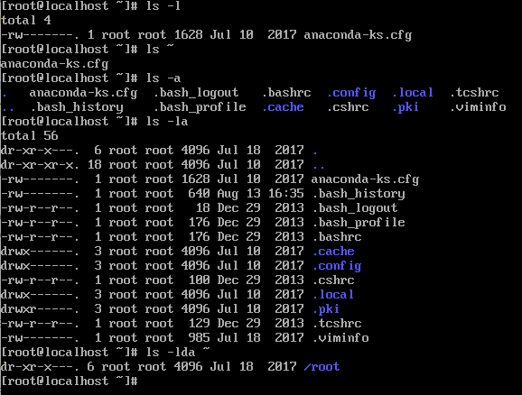
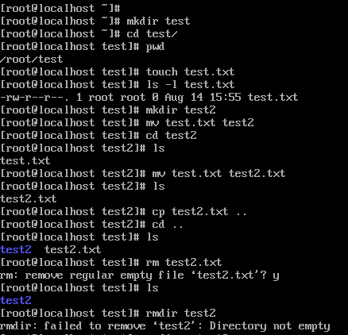
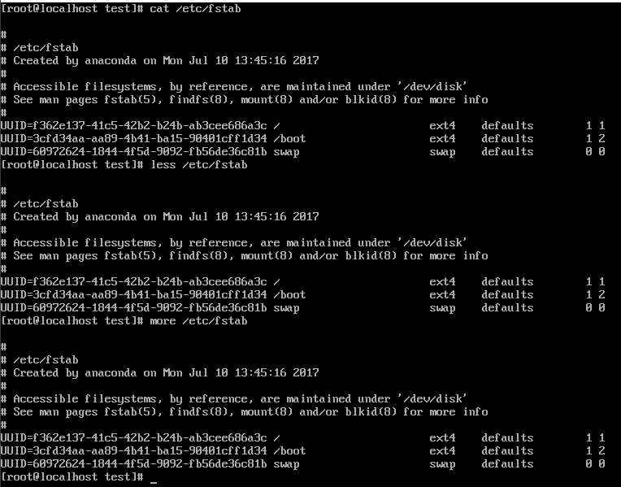

# Task5.2

**ls -l /** - shows the contents of the root directory /.  
**ls ~** - shows the contents of the home directory for this user. 
**ls -l** - use a long listing format. 
**ls -a** - do not ignore entries starting with . (hidden). 
**ls -la** - combination of two keys a and l. 
**ls -d** - list directories themselves, not their contents. 

Completed the list of commands from the assignment.

**mkdir test** - create directory 
**cd test** - go to directory test 
**pwd** - show current directory 
**touch test.txt** - create file test.txt 
**mv test.txt test2** - rename test.txt to test2 
**cp test2.txt ..** - copy file test2.txt to parent directory 
**cd ..** - change to parent directory 
**rm test2.txt** - delete file test2.txt 
**rmdir test2** - delete directory test2. The directory is not empty, so it will not be deleted. To  remove a non-empty directory, we can use the command **rm -R test2**.

**cat /etc/fstab** - display file content 
**less /etc/fstab** - powerful command for scrolling through text. has many additional parameters 
**more /etc/fstab** - program for page-by-page text viewing 