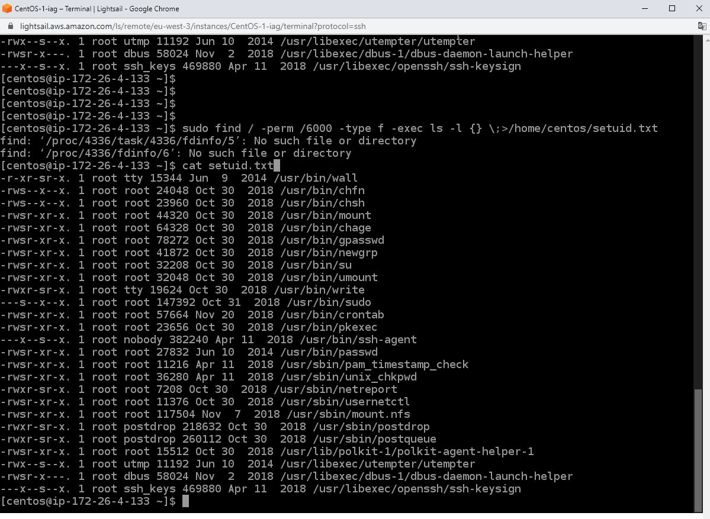
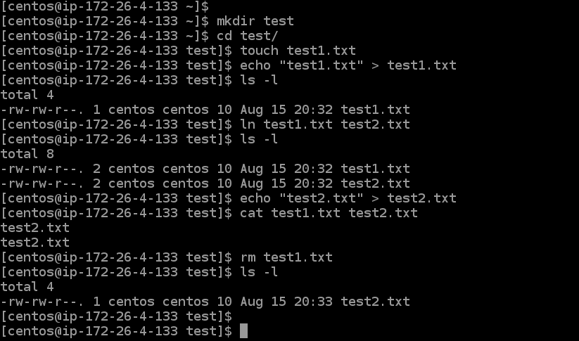
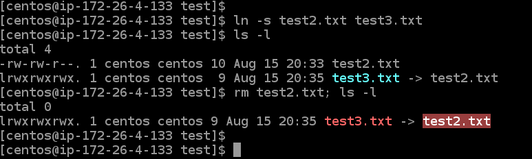
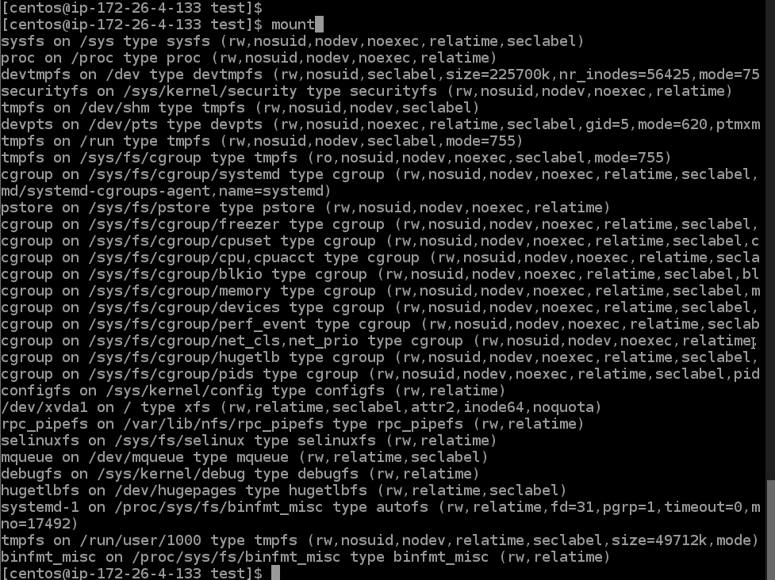
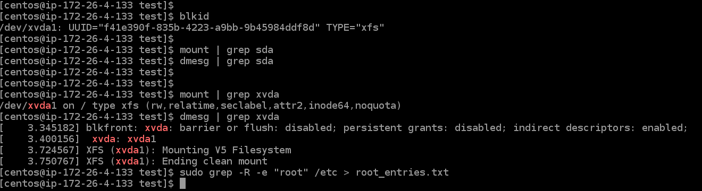
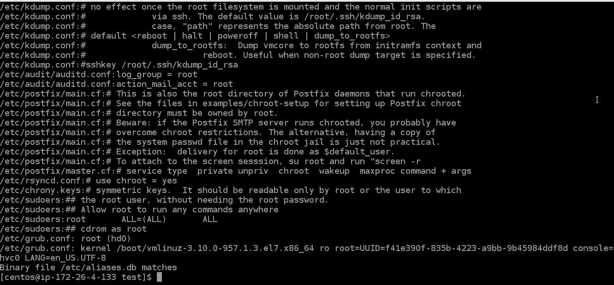

# Task5.3

parameters of the find command: 
**-perm** - search files in Linux by access mode 
**-type f** - search only files 
**-exec** - To execute arbitrary commands for found files  

**Hard links** 
The file is located only in a specific location on the hard drive. But this location can be referenced by multiple links from the file system. Each of the links is a separate file, but they lead to one section of the hard drive.

**Soft links** 
Symbolic links are like regular shortcuts. They contain the address of the desired file on your file system. When you try to open such a link, the target file or folder opens. Its main difference from hard links is that when the target file is deleted, the link will remain, but it will point to nowhere, since the file actually no longer exists. 

**mount** - View a list of all mounted devices 
**blkid** - View uuid for your sections 
**dmesg** - is designed to use the utility of the same name that displays messages from the OS kernel 

