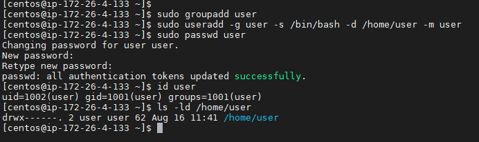
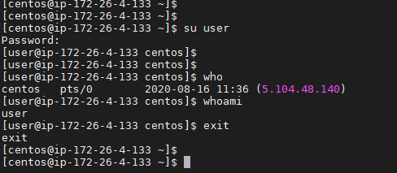
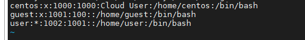
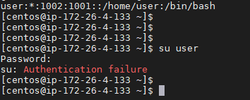
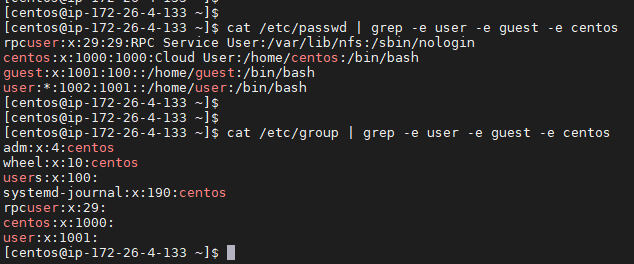
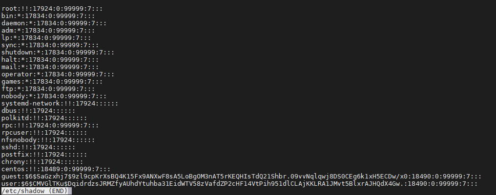
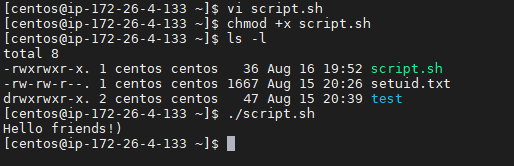
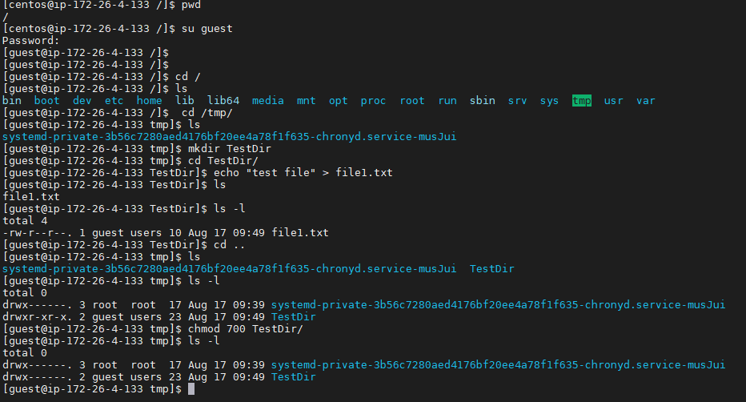
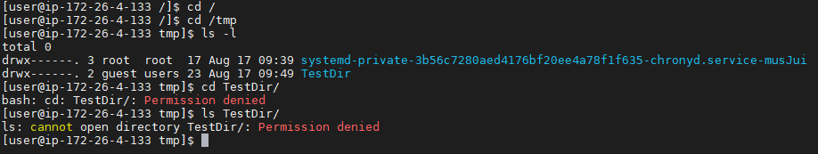

# Task5.4

Create a user user who is a member of the user group



Log in to the system as a user.



Let's edit / etc / passwd to prevent user from logging into the system.



When we try to log in as a user, we see an error.



Let's display the contents of files that belong to users guest, user, centos (vice root).



The commands below display the contents of files by specific columns:
```bash
cut -f1 -d: /etc/passwd
cut -f1,2 -d: /etc/passwd
cut -f1,7 -d: /etc/passwd
cut -f1 -d: /etc/group
cut -f1,2 -d: /etc/group
```
Content of file /etc/shadow:<br>



**/etc/shadow** is a text file containing information about the passwords of system users. it contains one entry per line, each representing a user account.


Let's create a script file, make it executable and run



Create a folder called TestDir under the guest, create a file inside, and also change the rights to the folder so that only the folder owner can read its contents. Then log into the system as user user and see that when we try to enter the testdir folder or read its contents, we have no access.






The file owner can be prevented from reading or writing content to the file. This can be done using the command **chmod**. An example in the screenshot below


