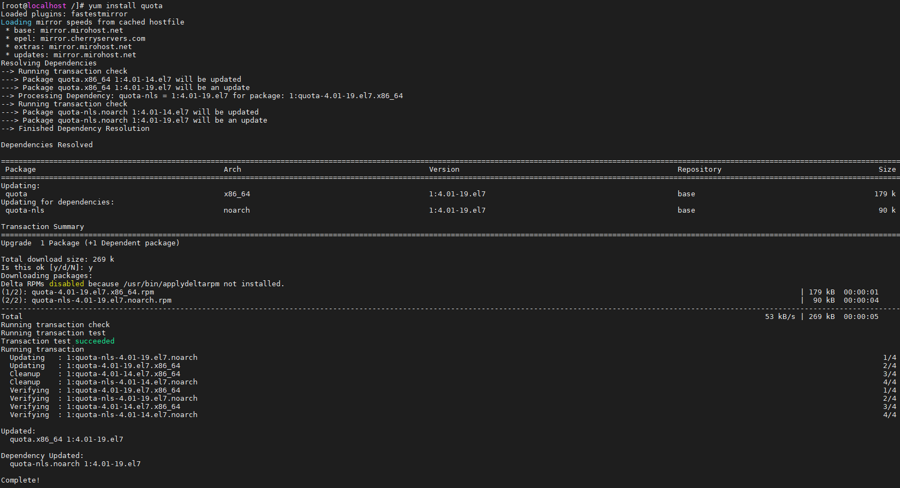
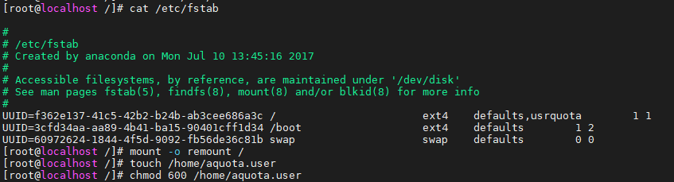
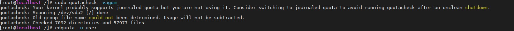
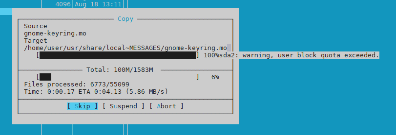
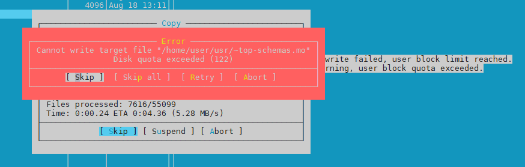
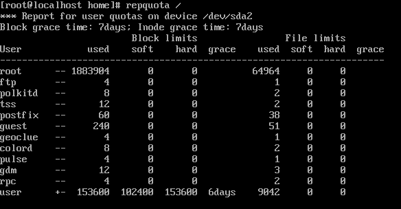

# Task5.5
First install the quota package on the system.

Then we will edit the **/etc/fstab** file and bring it to this form:

Let's create a **aquota.user** file, set the rights to it and enable quotas for the file system.

Then we will try to copy the files to the /home/user directory. When the 100MB limit is reached, we see a warning.

And when the limit reached 150MB, we saw an error.

Quota report is below:

