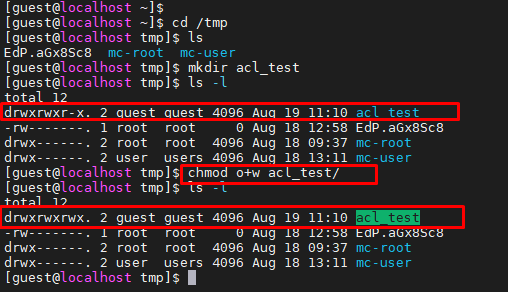
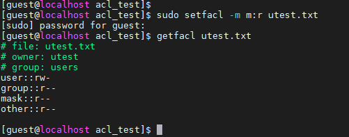

# Task5.6

Let's log in as a `guest`. Using the `blkid` command, we will determine the name of the mounted device and determine if the `acl` is enabled  it.

We see that the `acl` is on.

Create directory `/tmp/acl_test` on behalf of the `guest` user. Using the `chmod` command, we will expose all users to `rwx` rights to this folder.

Let's check that the user `utest` can actually exercise the privileges granted to him. For example, logged in as `utest`, create a file in `/tmp/acl_test`, say `utest.txt`.

With the command `setfacl -m u:utest:r acl_test/` set the rights to the folder for the user `utest` only for reading.

Let's try to perform actions on the folder on behalf of the user `utest`.

Let's make sure that the `ACL` has a higher priority than the permissions set using `chmod`.
With the help of `chmod 740` we will set the rights for other users only, and with the help of ACL we will give full access for the user `utest`.

We see that, as a result, the `utest` has the rights to write in this folder.

Set the default permissions for the `utest` user to be read-only on the `acl_test` folder (use `-d` key). Thus, all files and folders that will be created inside the `acl_test` folder will receive these rights by default for the user `utest`. 

We will verify this by creating the file `utest3.txt` on behalf of `utest` and see the rights to it with the `getfacl` command.

Set the maximum permissions mask on the `/tmp/acl_test/utest.txt` file in such a way
as to allow read-only access. Check permissions with `getfacl`.

Delete all ACL entries relative to the /tmp/acl_test directory.

