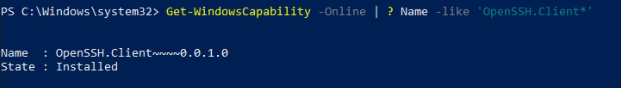
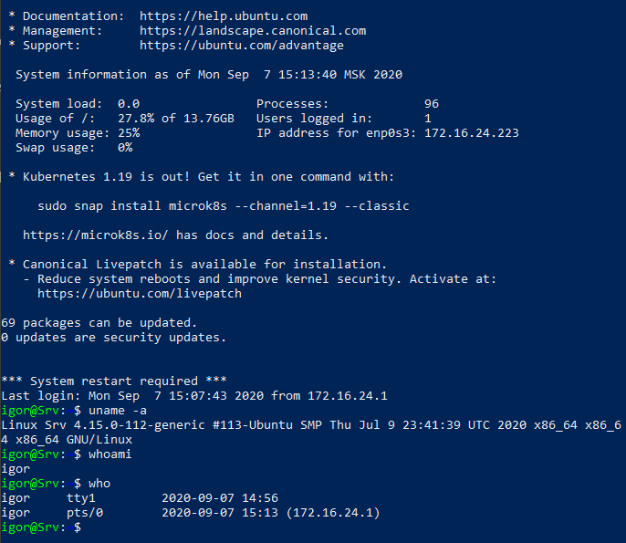
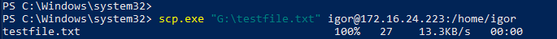
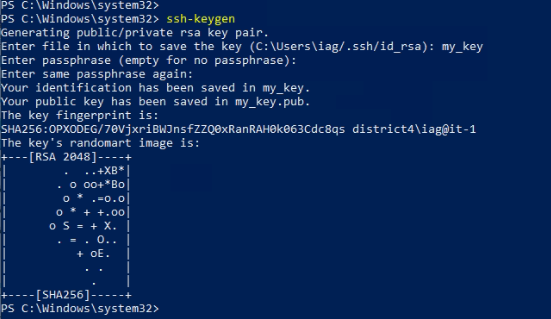
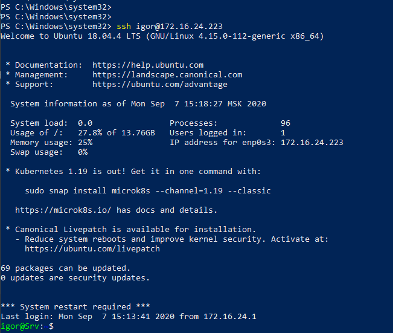
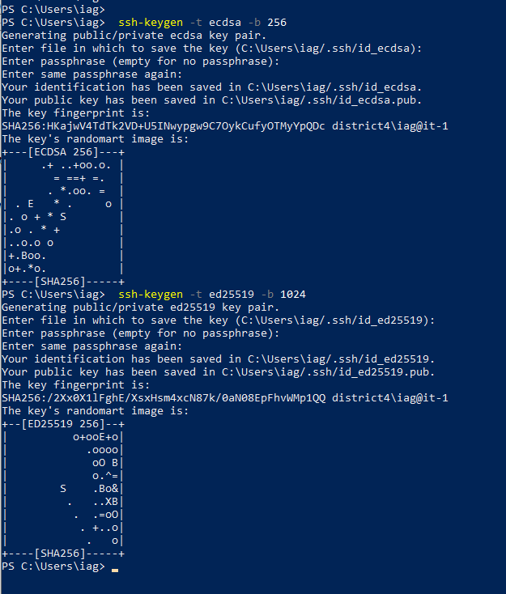
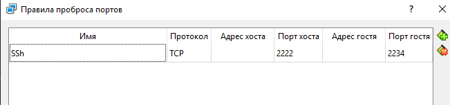
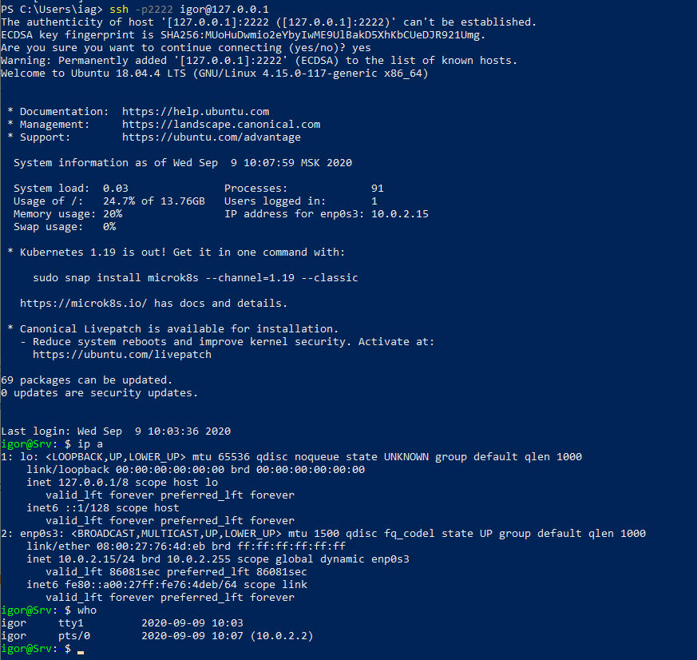
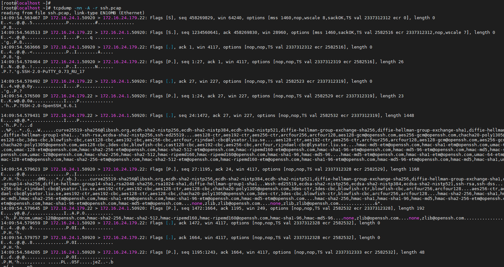
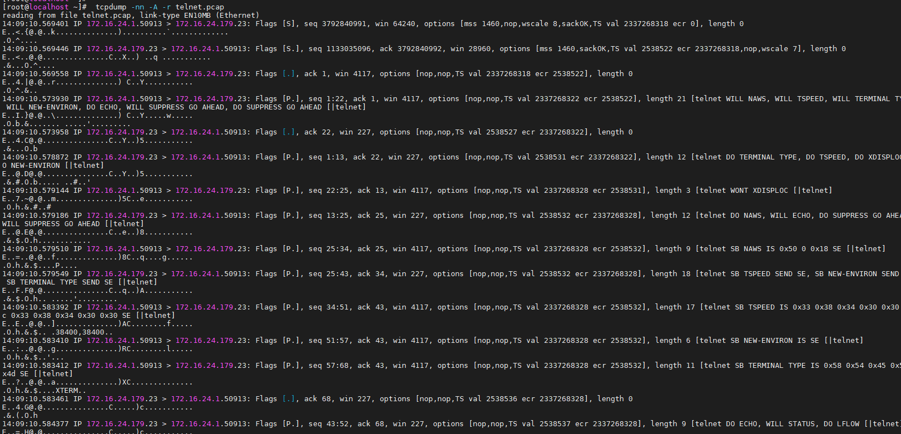

# Task5.7

## 1.
Let's check the basic OpenSSH commands in Windows. In this case, we will use Windows 10 OS.

Checking that the SSH client is installed on the system:



Let's connect to a virtual machine on Centos 7:



Using the scp utility, you can copy a file from your computer to the SSH server:



We can generate a pair of keys for access via SSH without a password:



And now we can connect only by key without entering a password.



## 2.

There are a few basic settings that can be configured to help make our SSH connection more secure.
Settings are set in the file **/etc/ssh/sshd_config**.
To increase the security of the connection, it is recommended to disable the root user from connecting to the system:
```bash
PermitRootLogin no
```
To allow access only to a specific group of people and deny it to everyone else, there are the AllowUsers and AllowGroups parameters. For example

```bash
AllowUsers igor, guest
AllowGroups igor, sudo
```
Change SSH port to a non-standard:
```bash
Port 22540
```
You can disable password authentication:
```bash
PasswordAuthentication no
```

## 3.

When generating a key pair, you can select the type of encryption and key length. In PowerShell the type of encryption is set by the key **-t**, and the length of the key is **-b**.



## 4.
Let's forward port 2222 to 2234 in the virtual box settings.



The screenshot shows an example of connecting to a VM for NAT.



## 5.

To capture traffic **SSH**, use the command

```bash
tcpdump -i enp0s3 -c50 -nn -w ssh.pcap -A port 22
```

and for **telnet**

```bash
tcpdump -i enp0s3 -c50 -nn -w telnet.pcap -A port 23
```
With SSH connections, the data is transmitted in encrypted form, with telnet in the open.






