# Task6.2

First of all, we will install and configure the DHCP server using **VBoxManage**, for which we will run the command:

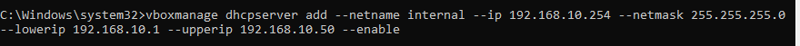

Check if VM2 and VM3 have received the appropriate network settings:

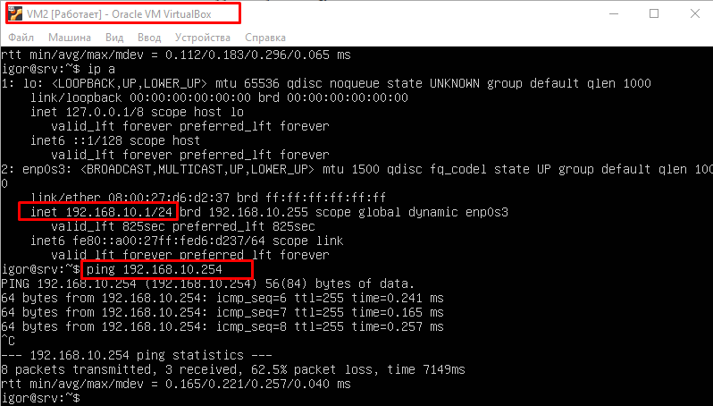

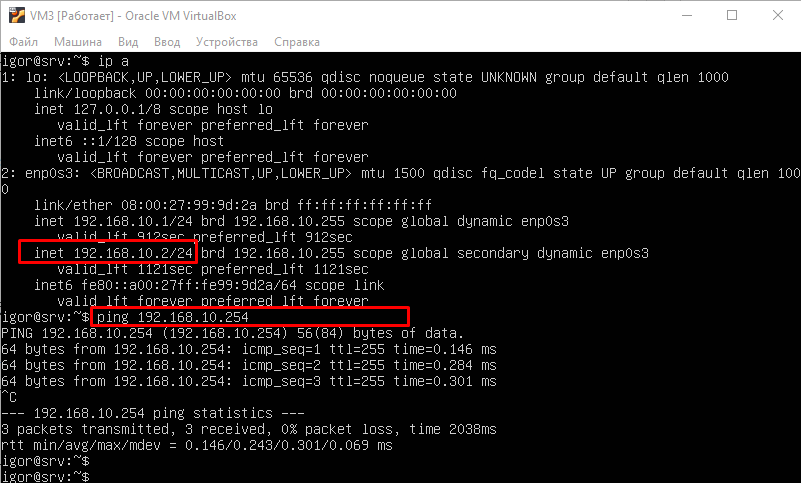

To remove the DHCP server, use the command:

Now we will use the second method - the DNSMASQ utility. The screenshots below show the settings of the DHCP server itself, as well as the network settings for vm1 and vm2. We see that the hosts receive addresses and communication is working between them.

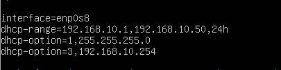

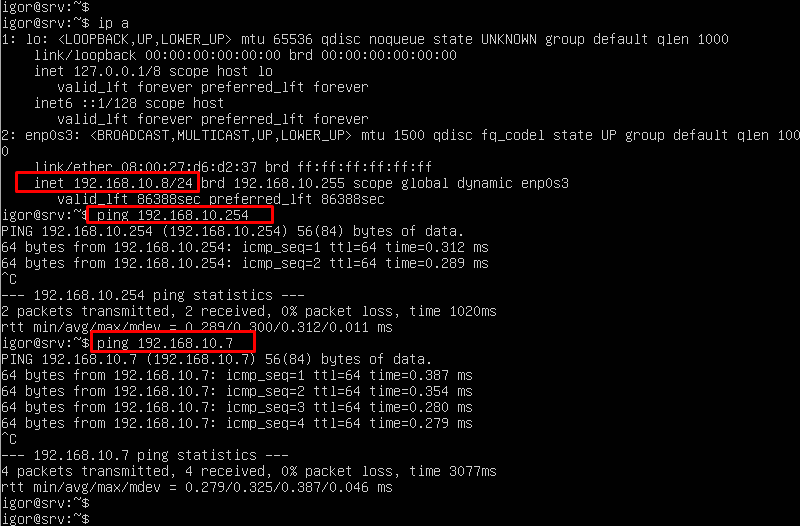

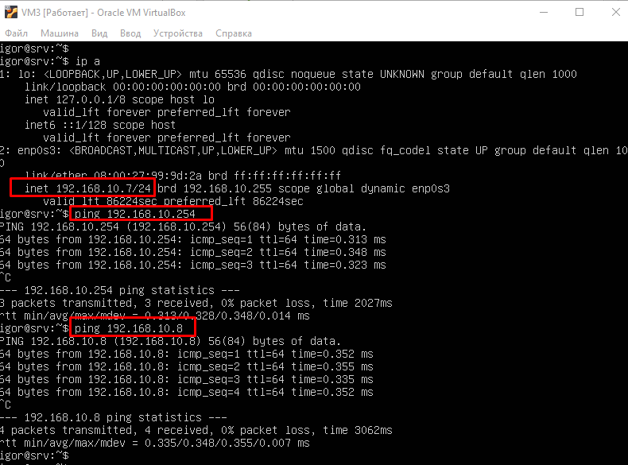

Now let's configure the DNS server on **VM1**.

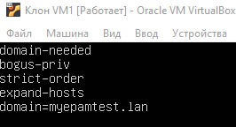

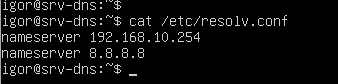

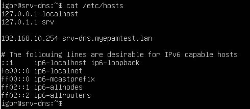

Now let's check the work of the dns server from the client machine

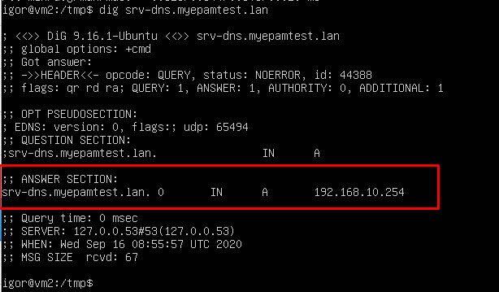

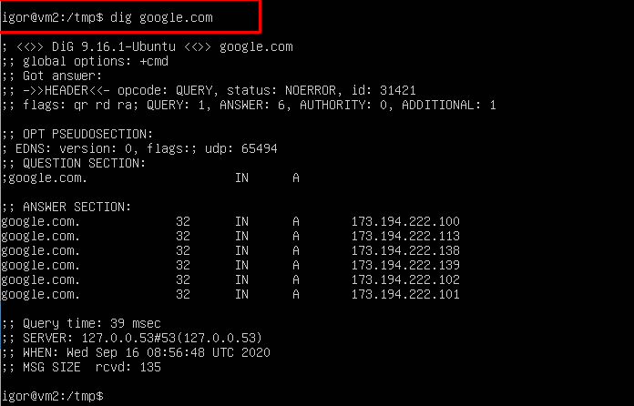