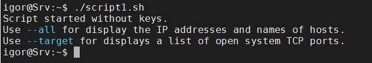

# Task6.3
<a href="source%2Fscript1.sh" target="_blank">You can download the script here</a>

Here is the content of the script:

```bash
#!/bin/bash

function get_dnsname {
name=`host $1 | awk '{print $5}'`
echo $name
}

function scan_all {
subnet=`hostname -I | cut -d. -f '1 2 3'`
for i in {1..254}
do
ip=$subnet.$i
(ping -c 1 -w 5 $ip > /dev/null && echo "IP: $ip found!" && echo `get_dnsname $ip`)
done
echo "Finished"
}

function scan_ports {
for i in {1..1023}
do
(nc -zv $1 $i &> /dev/null && echo "Port $i is open!" &)
done
echo "Scan finished."
}

if [ $# -eq 0 ]; then
echo "Script started without keys."
echo "Use --all for display the IP addresses and names of hosts."
echo "Use --target for displays a list of open system TCP ports."
exit
fi

if [ $1 == "--all" ]; then
scan_all
exit
fi

if [ $1 == "--target" ]; then
scan_ports $2
exit
fi
```

An example of calling a script with a key **--target**:


An example of calling a script without keys:



An example of calling a script with a key **--all**:


I faced the problem that some addresses from my DNS server on the Windows Server are not resolving, which I have not yet been able to eliminate.

But subnet scan works.