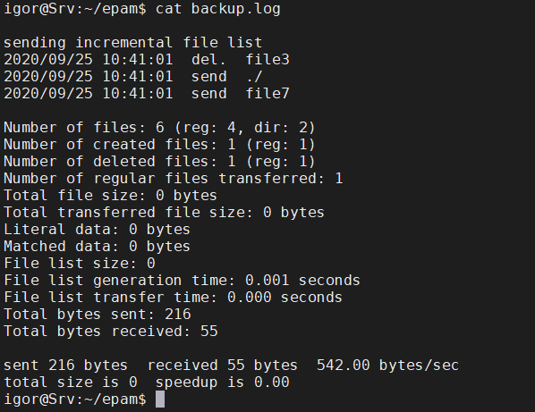

# Task6.5

Let's create such a <a href="source%2Fscript_backup.sh" target="_blank">script</a> to synchronize the contents of directories.

Let's add the following entry to the cron task scheduler, which means the script starts every minute.

This is the log of the скщт planner, we see that our task is executed every minute.

The content of the log file looks like this. There is an entry for added files and deleted files.

