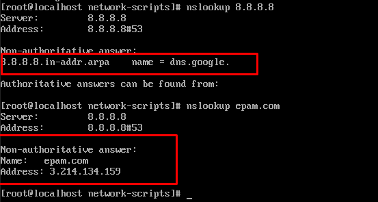

# Task6a_1

Let's create 2 virtual machines. VM1 (with a name Centos7_EPAM) and two network interfaces - internal and NAT and VM2 (with a name Клон Centos7EPAM) and one internal interface.


First, let's configure the internal interfaces


To access the Internet from VM2 through VM1 to the Internet, set the rules for FORWARD and NAT. You also need to set a kernel parameter that allows packets to be passed between interfaces. To do this, add a variable to the **/etc/sysctl.conf** file:

```bash
net.ipv4.ip_forward = 1
```

To apply the changes, run the command

```bash
sysctl -p /etc/sysctl.conf
```


Let's check that the vm2 has access to the Internet and a host computer.


Find out which resource the IP address 8.8.8.8 belongs to and which IP address belongs to epam.com.




Default gateway for VM2 is **192.168.0.1**


